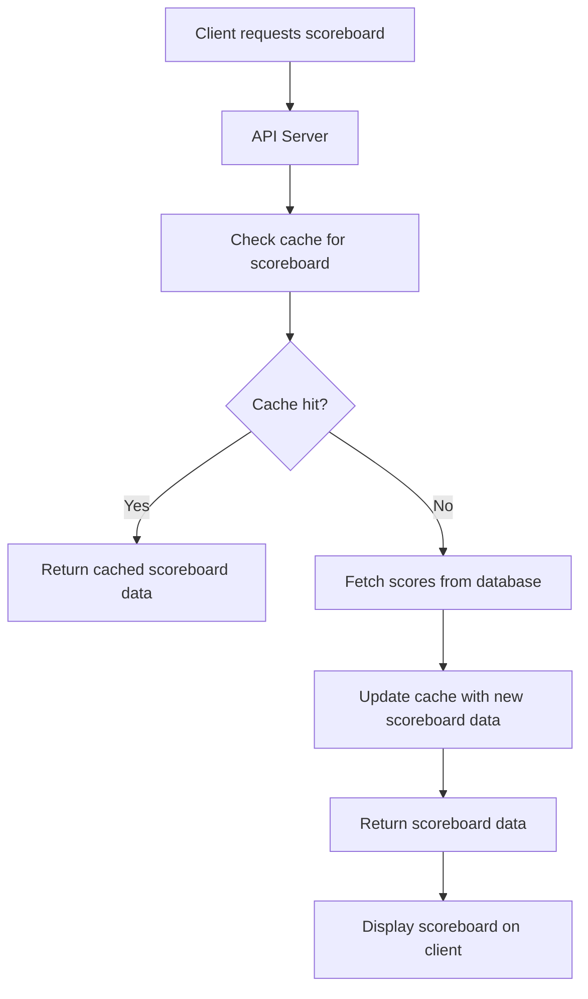
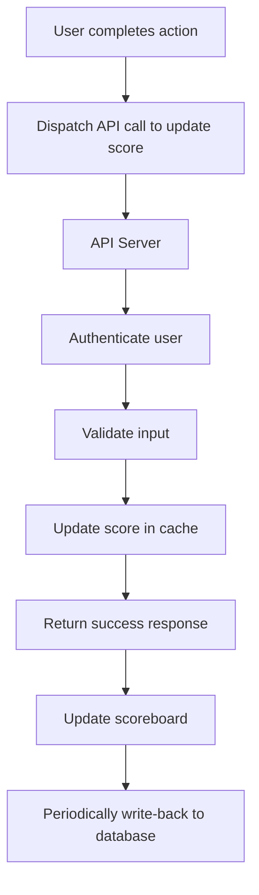
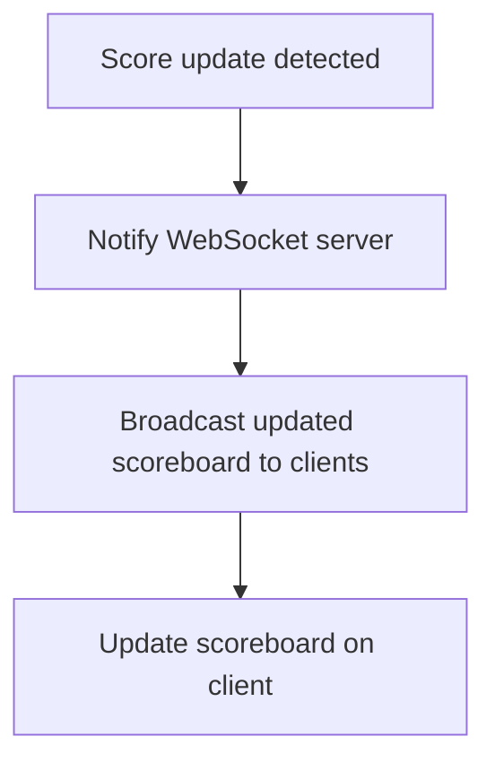

# Problem 6 - 99 Tech Code Challenge

API Service Module Specification

## Table of Contents
1. [Overview](#overview)
2. [Requirements](#requirements)
3. [API Endpoints](#api-endpoints)
   - [Get Scoreboard](#get-scoreboard)
   - [Update Score](#update-score)
4. [WebSockets Flow](#websockets-flow)
5. [Security Measures](#security-measures)
6. [Setup and Running](#setup-and-running)
7. [Improvements](#improvements)

## Overview

This module is responsible for managing the live update of the scoreboard on our website. It handles user actions that increase scores and ensures secure and authorized updates to the scoreboard.

## Requirements

1. **Live Scoreboard Update**: The scoreboard should display the top 10 user scores and update in real-time.
2. **User Actions**: Users can perform actions that increase their scores.
3. **API Call**: Upon completing an action, an API call is dispatched to update the user's score.
4. **Security**: Prevent unauthorized score increases by malicious users.

## API Endpoints

### Get Scoreboard

- **Endpoint**: `/api/scoreboard`
- **Method**: `GET`
- **Description**: Retrieves the top 10 user scores.
- **Response**:
  - `scoreboard` (array): An array of user scores, each containing:
    - `userId` (string): The ID of the user.
    - `score` (number): The user's score.

**Example Request:**

```bash
curl -X GET http://yourdomain.com/api/scoreboard
```

**Example Response:**

```json
{
  "scoreboard": [
    { "userId": "user1", "score": 100 },
    { "userId": "user2", "score": 95 },
    ...
  ]
}
```



**Caching Strategy:**

Implement caching for the scoreboard to reduce database load.

- **Sorted Set**: Use a Sorted Set to store user scores in the cache. This allows for efficient retrieval of the top scores and maintains the order of elements based on their score values.
  - **Why**: Sorted Sets provide O(log N) complexity for insertion and retrieval operations, making them suitable for maintaining a leaderboard.

- **Write-back Cache**: Use a write-back caching strategy to update the database.
  - **Why**: Write-back caching improves performance by reducing the number of write operations to the database. Changes are first written to the cache and then periodically written back to the database in batches.

- **Batch Updates**: Periodically update the database with the latest scores from the cache.
  - **Why**: Batch updates reduce the load on the database by grouping multiple write operations into a single transaction. This improves overall system performance and reduces the risk of database contention.

### Update Score

- **Endpoint**: `/api/scoreboard`
- **Method**: `POST`
- **Description**: Updates the user's score upon completing an action.
- **Request Headers**:
  - `Authorization` (string): Bearer token for authentication.
- **Request Body**:
  - `action` (string): The action completed by the user.
- **Response**:
  - `success` (boolean): Indicates if the score update was successful.
  - `newScore` (number): The user's new score.

**Example Request:**
```bash
curl -X POST http://yourdomain.com/api/scoreboard \
  -H "Content-Type: application/json" \
  -H "Authorization: Bearer <your_jwt_token>" \
  -d '{"action": "completed_challenge"}'
```

**Example Response:**
```json
{
  "success": true,
  "newScore": 110
}
```



## WebSockets Flow

Use WebSockets for real-time updates instead of polling.



## Security Measures

1. **Authentication**: Ensure that the user is authenticated before allowing score updates.
2. **Rate Limiting**: Implement rate limiting to prevent abuse of the score update endpoint.
3. **Input Validation**: Validate the input data to prevent injection attacks.
4. **Encryption**: Use HTTPS to encrypt data in transit.

## Improvements

1. **Real-Time Notifications**: Notify users instantly when someone overtakes another in the top 10
2. **Achievements System**: Implement an achievements system to reward users for reaching specific score milestones.
3. **Point Contention**: Enable users to "steal" or "win" points from others by completing specific challenges or outscoring them in a head-to-head contest.
4. **Referral System**: Reward users for inviting new players who join and perform actions, encouraging organic growth.
5. **Friend-Based Leaderboard**: Allow users to view a separate leaderboard of their friends's scores for a more social experience.
